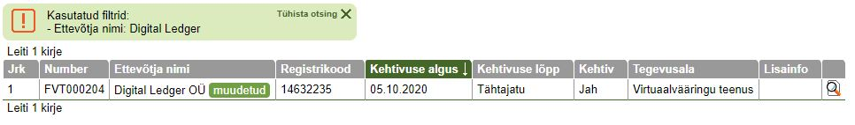

## Документы с ICO

- [Prospectus от Мая 2017](docs/ico/prospectus.pdf)
- [Whitepaper от Мая 2017](docs/ico/token_whitepaper.pdf)
- [Business model от Мая 2017](docs/ico/business_model.pdf)
- [Escrow arrangement](docs/ico/escrow_arrangement.pdf)
- [Terms and coditions](docs/ico/terms_and_conditions.pdf)
- [Privacy Policy](docs/ico/privacy_policy.pdf)
- [видео Meet Polybius, скрыто на официальном канале](https://www.youtube.com/watch?v=LEQoFuJ2Zx8)

## Финансовые отчеты

- [Годовой отчет 2018, est](docs/finance/Polybius Foundation OÜ_aruanne_2018_est.pdf)
- [Годовой отчет 2017, eng](docs/finance/Polybius Foundation OÜ_aruanne_2017_eng.pdf)

## Статьи в медиа

- 20.05.2020 [Ида-Вируские криптомиллионеры одержали победу над малым инвестором](docs/article/Ида_Вируские_криптомиллионеры_одержали_победу_над_малым_инвестором.pdf), [**Источник**](https://www.dv.ee/novosti/2020/05/20/ida-viruskie-kriptomillionery-oderzhali-pobedu-nad-malym-investorom)
- 14.01.2020 [Криптобанк Polybius, собравший €28 млн, может так и остаться мечтой](docs/article/Криптобанк Polybius, собравший €28 млн, может так и остаться мечтой.pdf), [**Источник**](https://www.dv.ee/novosti/2020/01/14/kriptobank-polybius-sobravshij-28-mln-mozhet-tak-i-ostatsja-mechtoj)
- [Деловые ведомости](https://www.dv.ee/search?q=Polybius&sort=date)

## Cуд


- 06.01.2020 [Отказ в апелляции, Решение суда, est](docs/lawsuit/kohtuotsus_06.01.2020.pdf), [**Источник**](https://www.riigiteataja.ee/kohtulahendid/fail.html?fid=267093508)
- 28.05.2019 [Встречный иск, Решение суда, est](docs/lawsuit/kohtuotsus_28.05.2019.pdf), [**Источник**](https://www.riigiteataja.ee/kohtulahendid/fail.html?fid=267732495)
- [2-18-16076](https://www.riigiteataja.ee/kohtulahendid/otsingutulemus.html?kohtuasjaNumber=2-18-16076)
- [Юристы полибиуса](https://www.sorainen.com/deals/estonian-court-explains-tokenholders-rights)

### Лицензии полибиуса



- [Virtuaalvääringu raha vastu vahetamise teenus - FVR000810](https://mtr.mkm.ee/taotluse_tulemus/506097)
- [Virtuaalvääringu rahakotiteenus - FRK000612](https://mtr.mkm.ee/taotluse_tulemus/501496)

## Арxив www.polybius.io

```
Основные документы были добавлены только в Июне (в Мае доступен только проспект). 
По ходу проведения ICO менялись адвайзеры и майлстоуны. 
```

- [Web archive сайта от апреля 2017 года](https://web.archive.org/web/20170420094524/http://www.polybius.io/)
- [Web archive сайта от мая 2017 года](https://web.archive.org/web/20170517064646/https://polybius.io/)
- [Web archive сайта от июня 2017 года](https://web.archive.org/web/20170604144240/https://polybius.io/#documents)
- [Web archive сайта от августа 2017 года](https://web.archive.org/web/20170806071446/https://polybius.io/)

### Ссылки

- [Список ресурсов где Polybius рекламировал себя как банк до ICO](links.md)
- [Правила получения криптолицензии в Эстонии](https://forklog.com/yuristy-rasskazali-o-novyh-pravilah-polucheniya-kriptolitsenzii-v-estonii)
- [Как Эстония регулирует ICO и криптовалюты](https://lawstrust.com/news/kak-ehstoniya-reguliruet-ico-i-kriptovalyuty)
- [Коллективный иск на EOS после ICO](https://forklog.com/protiv-block-one-broka-pirsa-i-dena-larimera-podan-kollektivnyj-isk-v-svyazi-s-ico-proekta-eos/)